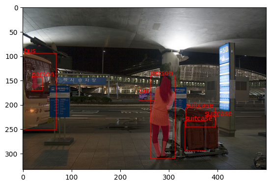
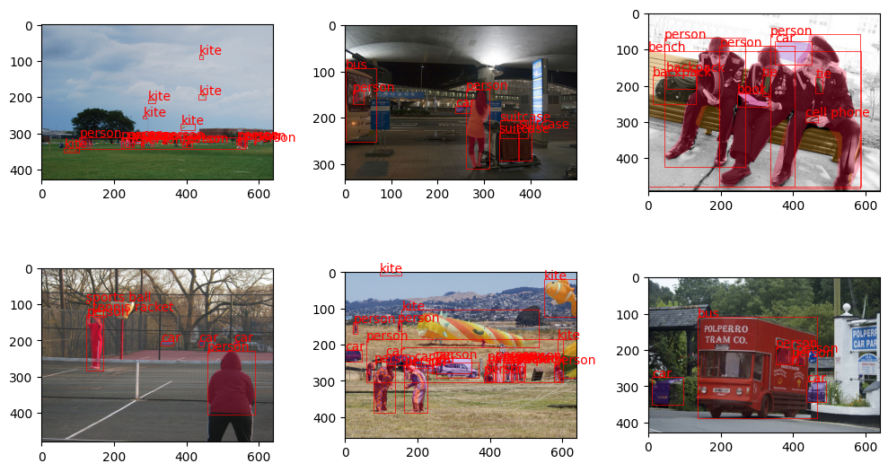
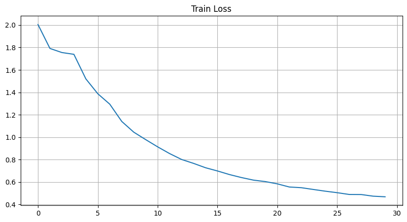
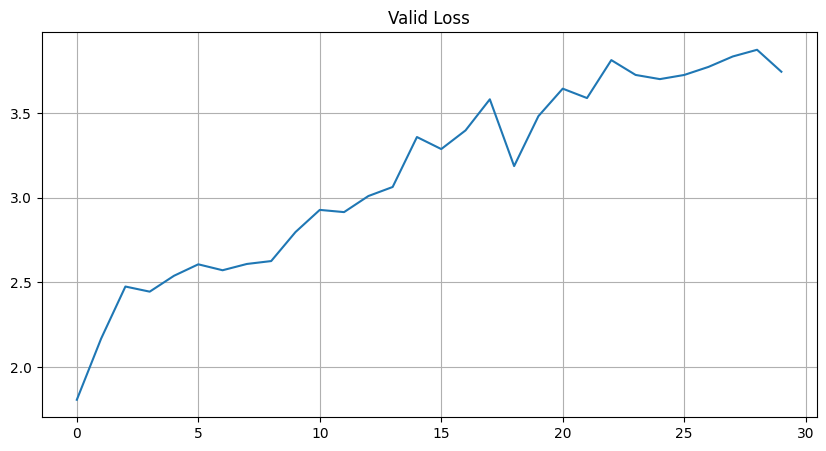
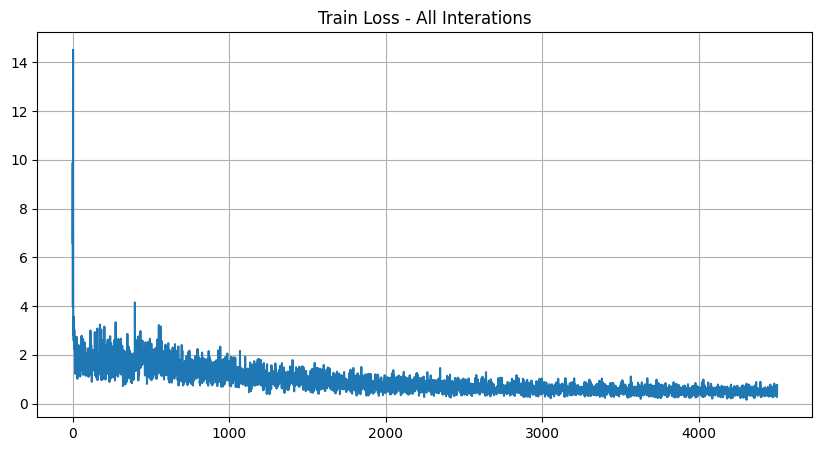
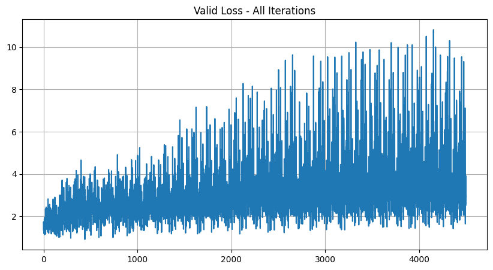

# Instance Segmentation with Mask R-CNN

A deep learning project implementing **instance segmentation** using a fine-tuned **Mask R-CNN** model with a ResNet-50 FPN backbone, trained on a COCO-format dataset using PyTorch.


---

## Overview

This project tackles **instance segmentation** — one of the most challenging tasks in computer vision — where the model must:

- Detect every object in an image
- Classify each detected object
- Generate a **pixel-level mask** for each instance

The model is built on top of a **pretrained Mask R-CNN (ResNet-50 + FPN)** from torchvision and fine-tuned end-to-end on a custom COCO-format dataset.

---

## Key Highlights

- **Transfer Learning** — Fine-tuned a pretrained Mask R-CNN model, replacing the classification head to match the target dataset's categories
- **Custom Dataset Pipeline** — Implemented a PyTorch `Dataset` class with full COCO API integration for annotation parsing, mask generation, and bounding box extraction
- **End-to-End Training** — Full training loop with SGD optimizer, per-batch loss logging, and validation at every epoch
- **Loss Tracking & Visualization** — Tracked multi-component losses (classifier, box regression, mask, RPN) across 30 epochs and plotted training/validation curves
- **GPU Accelerated** — Automatically selects CUDA, MPS (Apple Silicon), or CPU
- **Qualitative Evaluation** — Visualized predicted masks and bounding boxes overlaid on images with per-category color coding

---

## Model Architecture

```
Input Image
    │
    ▼
ResNet-50 Backbone (pretrained on ImageNet)
    │
    ▼
Feature Pyramid Network (FPN)
    │
    ▼
Region Proposal Network (RPN)
    │
    ▼
RoI Align
    │
    ├──► Box Predictor (FastRCNN Head) → Class + Bounding Box
    │
    └──► Mask Head → Binary Pixel Mask per Instance
```

- **Backbone**: ResNet-50 with FPN — extracts multi-scale features
- **RPN**: Generates region proposals from feature maps
- **Box Predictor**: Custom `FastRCNNPredictor` head for target class count
- **Mask Head**: Predicts a 28×28 binary mask per detected instance, upsampled at inference

---

## Dataset

The dataset follows the **COCO annotation format** with three splits:

| Split | Images | Annotations File |
|-------|--------|-----------------|
| Train | 300 | `train-300/labels.json` |
| Validation | 300 | `validation-300/labels.json` |
| Test | 30 | `test-30/` |

Each image is normalized using **ImageNet statistics** (mean/std), and all annotations include:
- Bounding boxes (COCO `[x, y, w, h]` format → converted to `[x1, y1, x2, y2]`)
- Binary instance masks (generated via `pycocotools.annToMask`)
- Category labels

---

## Training Details

| Hyperparameter | Value |
|---------------|-------|
| Epochs | 30 |
| Batch Size | 2 |
| Optimizer | SGD |
| Learning Rate | 0.005 |
| Momentum | 0.9 |
| Device | CUDA (GPU) |

The model was trained for **30 epochs**, with loss logged every 25 batches. Both training and validation losses were saved for analysis.

---

## Visualizations

### Sample Predictions

Single image with instance masks and bounding boxes overlaid:



Grid of 6 training samples with ground-truth annotations:



---

## Results

The model was trained for **30 epochs** on 300 images. The multi-task loss includes contributions from:

- **RPN classification loss** (objectness)
- **RPN bounding box regression loss**
- **RoI classification loss**
- **RoI bounding box regression loss**
- **Mask loss** (binary cross-entropy per pixel)

### Training Loss (per epoch)

Training loss dropped consistently from **~2.0 → ~0.45** over 30 epochs, showing strong convergence.



### Validation Loss (per epoch)



> The rising validation loss indicates overfitting on this small dataset (300 images), which is expected for a large model like Mask R-CNN. This can be addressed with data augmentation, regularization, or a larger dataset.

### Batch-Level Loss Curves

<table>
  <tr>
    <td></td>
    <td></td>
  </tr>
  <tr>
    <td align="center">Train Loss — All Batches (~4500 iterations)</td>
    <td align="center">Valid Loss — All Batches</td>
  </tr>
</table>

---

## Project Structure

```
RM_Segmentation_Assignment/
│
├── co2.ipynb               # Main notebook: data loading, training, evaluation, visualization
├── requirements.txt        # Python dependencies
├── train_losses.pth        # Saved training loss history (per batch, per epoch)
├── valid_losses.pth        # Saved validation loss history
├── assets/                 # Result images for README
│   ├── sample_prediction.png
│   ├── sample_grid.png
│   ├── train_loss_epochs.png
│   ├── valid_loss_epochs.png
│   ├── train_loss_all.png
│   └── valid_loss_all.png
│
├── train-300/              # Training set (300 images + COCO annotations)
│   ├── data/
│   └── labels.json
│
├── validation-300/         # Validation set (300 images + COCO annotations)
│   ├── data/
│   └── labels.json
│
└── test-30/                # Test set (30 images)
    └── *.jpg
```

> **Note**: `coco_model.pth` (trained weights, ~170MB) is excluded from the repo due to GitHub's file size limit. Re-train using the notebook or contact me for the weights.

---

## Setup & Usage

### 1. Clone the Repository

```bash
git clone https://github.com/Rakshithch/RM_Segmentation_Assignment.git
cd RM_Segmentation_Assignment
```

### 2. Install Dependencies

```bash
pip install -r requirements.txt
```

> **Windows Note**: `pycocotools` requires a C++ compiler. If it fails, install [Visual Studio Build Tools](https://visualstudio.microsoft.com/visual-cpp-build-tools/) or use `pycocotools-windows`.

### 3. Run the Notebook

Open `co2.ipynb` in Jupyter and run all cells sequentially:

```bash
jupyter notebook co2.ipynb
```

The notebook covers:
1. Dataset loading and visualization
2. Model setup with custom head
3. Training loop (30 epochs)
4. Loss curve plotting
5. Qualitative result visualization

---

## Tech Stack

| Tool | Purpose |
|------|---------|
| **PyTorch** | Deep learning framework |
| **torchvision** | Pretrained Mask R-CNN model |
| **pycocotools** | COCO annotation parsing & mask generation |
| **NumPy** | Array operations |
| **Matplotlib** | Visualization |
| **Pillow** | Image loading |
| **CUDA** | GPU acceleration |

---

## Skills Demonstrated

- Computer Vision — Instance Segmentation
- Transfer Learning & Fine-tuning
- Custom PyTorch Dataset & DataLoader
- COCO API usage
- Training loop design with validation
- Loss monitoring and visualization
- GPU training with CUDA

---

## Author

**Rakshith C H**
[GitHub](https://github.com/Rakshithch)
